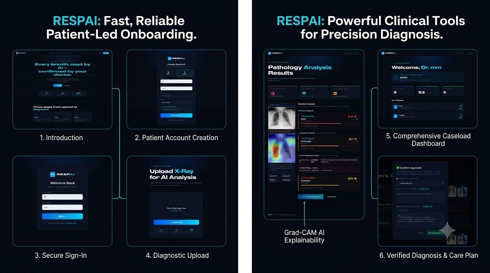

# RespAI – AI-Powered Chest X-ray Analysis System




RespAI is an AI-powered clinical decision support system designed to assist in chest X-ray interpretation using deep learning.

## Features

- AI-powered chest X-ray analysis
- Automatic disease probability estimation
- Grad-CAM heatmap visualization
- Clinical summary generation
- Doctor review and approval workflow
- PDF medical report generation
- Patient and doctor dashboards
- Secure authentication system

## Technologies

- Python
- Flask
- PyTorch
- TorchXRayVision
- SQLite
- HTML
- CSS
- JavaScript

## Project Structure

```
app.py
dashboard.py
result_filter.py
templates/
static/
model/
```

## Disclaimer

RespAI is intended as a clinical decision support tool and does not replace professional medical diagnosis.

## Future Improvements

- Cloud deployment
- PACS integration
- Multi-language support
- DICOM support
- Electronic Health Record (EHR) integration

## Author

Youssef
